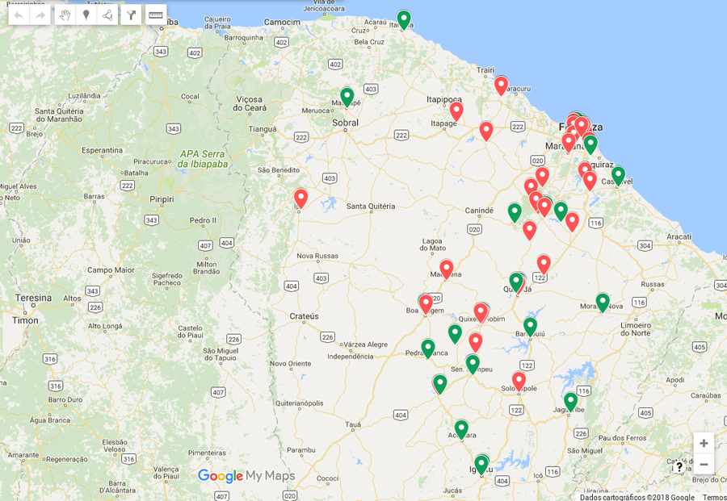

## ¢2018-02-05 Um bom começo #Noticías

## Vídeo Convite

<iframe width="560" height="315" src="https://www.youtube.com/embed/BTs6Bv7tJns" frameborder="0" allow="autoplay; encrypted-media" allowfullscreen></iframe>

## Links

- [Ofício de Solicitação para entregar ao Diretor da Escola](/assets/data/oficio.pdf)
- [Apresentação Slides](https://docs.google.com/presentation/d/1Drx1Z4UK19CmxWwNCCb7y6ILTk1u7dfUGx1SXSXGxgY/edit?usp=sharing)
- [Banner Benefícios](/assets/data/beneficios.pdf)
- [Banner Cursos](/assets/data/cursos.pdf)
- [Formulário de Inscrição para Participar como Palentrante](https://docs.google.com/forms/d/e/1FAIpQLSfsFMWL19uJyk-PbVb91MFPTa4ioyKYonAj5-Yg4PdzEP7opg/viewform?usp=sf_link)
- [Guia de Procedimentos](https://goo.gl/tQBeij)
- [Link e código para o grupo do Whatsapp se você é aluno e quer tirar dúvidas sobre a ufc](https://chat.whatsapp.com/7wClwncgYOlCSVLFsuiGUt)

## Convite às Escolas

Olá prezado(a) Diretor(a),
meu nome é David Sena, sou professor da UFC Quixadá e coordenador do projeto de Extensão UFC nas Escolas. Nesse dia 03 de agosto vamos realizar o 1o UFC Day. Gostaríamos de visitar sua Escola para divulgar a UFC e tirar dúvidas dos seus alunos em relação à vida universitária, cursos oferecidos, bolsas, auxílios, moradia, etc.

Aqui na UFC Quixadá temos alunos de mais de 80 cidades diferentes em 6 cursos de tecnologia. Com o tempo, percebemos que uma das maiores dúvidas e medos dos alunos é como será a vida longe de casa. Provavelmente, slendo esse post, é porque algum dos seus ex-alunos agora é nosso aluno e se voluntariou para voltar à sua escola de origem para compartilhar da experiência de universidade.

Nosso foco são as turmas de 2o e 3o anos, escolas profissionalizantes e cursinhos. Gostaríamos de pedir entre 20min e 50min para nossos alunos voluntários conversarem em cada uma dessas turmas. Dependendo da estrutura da escola e possibilidades, poderemos realizar as visitas da forma que for mais conveniente.

Abaixo, estão os materiais de divulgação que serão utilizados na visita. Fico à disposição no email ufcnasescolas@gmail.com para tirar qualquer dúvida.

## Escolas Participantes em 2017

Em 2017, tivemos a primeira edição do evento. Esse foi nosso mapa de visitas. Todos os marcadores correspondem a escolas cadastradas. Os marcadores verdes representam as escolas que foram visitadas e cujos articuladores entregaram as documentações, relatos e fotos. Os marcadores vermelhos correspondem às escolas que tiveram baixa adesão e que desejamos reforçar as visitas.

