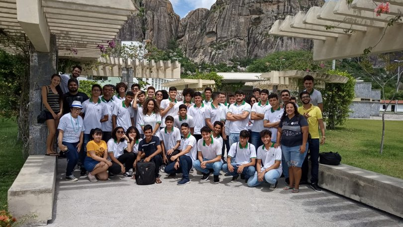

## ¢2019-05-07 Recepção da escola Joaquim Antônio Albano £Recepções

No dia 07 de maio, a escola profissional Joaquim Antônio Albano de Fortaleza visitou o Campus UFC Quixadá. A recepção foi realizada pelos bolsistas e voluntários do projeto de extensão UFC nas Escolas.

Foi ministrada para os alunos uma palestra sobre o nosso Campus, cursos, bolsas e experiência de vidas dos alunos da UFC-Quixadá. Durante a palestra os alunos secundaristas se mostraram bastante interessados nos cursos oferecidos pelo nosso Campus e fizeram bastante perguntas com relação às bolsas e estrutura da UFC.

Foi bastante gratificante perceber os frutos positivos desse nosso breve momento juntos. Tomara que seja tão importante para vocês como é para nós bolsistas. Esperamos que vocês venham mais vezes nos visitar e ficamos agraciados com a vida de cada um.
