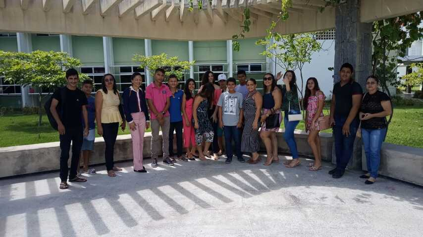

## ©recepcoes ð2019-05-08 Recepção da escola Paulo Sarasate
###

A turma do 9º ano do ensino médio da escola Paulo Sarasate, localizada na cidade de Banabuiú, percorreram cerca 57 km do dia 8 de Maio de 2019 para conhecer um pouco mais dos cursos e estrutura da UFC-Quixadá.

14 alunos com muita determinação e força de vontade para chegar até o ensino superior se dispuseram a ir até o campus para poder conhecer de perto tudo que irão usufruir quando tornarem-se universitários da UFC, pois é esse o objetivo da grande maioria deles.

A apresentação do campus aos alunos aconteceu de forma bem introspectiva, como de costume falamos dos cursos, bolsas, projetos e sobre a qualidade de estrutura que a UFC oferece aos seus universitários. Além de citarmos exemplos de alunos que se destacaram dentro e levaram o nome da UFC Quixadá à um elevado patamar.

Nos despedimos lembrando-os que quando  prestarem o Enem não esqueçam que a UFC Quixadá estará de braços abertos pra receber todos que desejarem ingressar nos nossos cursos.
