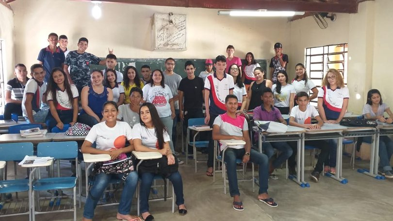

## ©visitas ð2019-05-12 Visita à escola Abraão Baquit
###

O projeto de extensão UFC nas Escolas também esteve à 40 km da cidade de Quixadá no anexo da Escola de Ensino Médio Abraão incentivando os alunos do distrito Cipó dos Anjos a entrar no ensino superior e apresentando todo o suporte que a universidade oferece: bolsas, auxílios e uma estrutura de qualidade.

Observamos também de perto as dificuldades  que o colégio enfrenta e a garra e força de vontade de cada aluno que está ali. Vimos o empenho da administração do colégio que vive buscando incentivar mais alunos a cursar o ensino superior.

Esperamos voltar mais vezes na escola. Foi muito gratificante poder passar um pouco da nossa experiência de vida e do nosso Campus UFC-Quixadá que está de braços abertos pra receber vocês. Venham nos conhecer na nossa estrutura.
