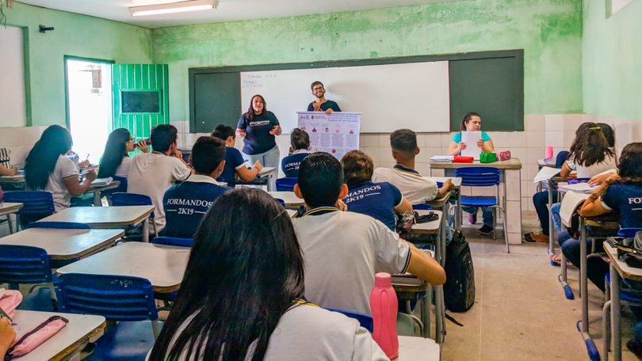

## ¢2019-05-15 Visita à escola Virgílio Távora £Visitas

O projeto UFC nas Escolas esteve na escola de ensino médio Virgílio Távora em Quixadá apresentando nossos cursos, bolsas e estrutura que a UFC nos oferece.

Diante a nossa exposição sobre o que é a universidade, muitos alunos se mostraram interessados nos cursos da UFC Campus Quixadá. Alguns alunos não conheciam ainda a UFC e expressaram que por causa da nossa ida à escola, eles ficaram muito contentes pois conheceram um pouco do que a UFC poderá oferecer futuramente pra eles.

A aluna Priscila do 3º ano da escola disse:

> Fiquei muito feliz com a vinda dos meninos do projeto UFC nas Escolas, pois não sabia que a faculdade proporciona tantos benefícios, como as bolsas e auxílios. Futuramente pretendo entrar na universidade para cursar o ensino superior para que no futuro eu possa dar uma boa condição de vida a meus pais.

Diante o relato da Priscila ficamos muito felizes por estarmos compartilhando e contribuindo para que no futuro, ela e outros alunos possam ingressar no ensino superior e ter a chance de mudarem de vida.

Vamos continuar contribuindo de todas as formas possíveis para outros alunos possam ser impactado da forma que Priscila foi. Agradecemos a escola também por nos disponibilizar o tempo necessário para apresentar o projeto e que queremos sempre manter a parceria pra voltar mais vezes ❤️
