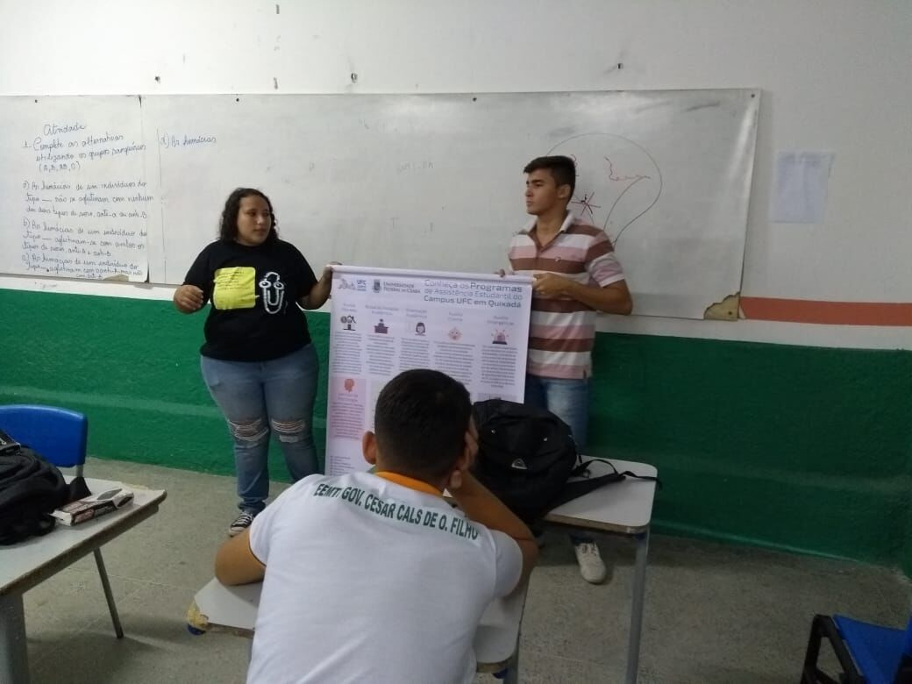

## ©visitas ð2019-05-23 Visita à escola Governador César Cals
###

Ontem estivemos na escola de ensino médio e integral, Gov. César Cals de Oliveira, mostrando um pouco sobre o projeto UFC nas Escolas, em cada escola que passamos nos deixa experiências únicas e incríveis, e a escola César Cals foi uma delas, a gente falou sobre os cursos e bolsas e estruturas da UFC, e falamos também da experiência que cada membro do projeto UFC nas Escolas superou para chegar até a universidade.

O @miguelneto_9 membro do projeto relatou que cursa Engenharia de Software e está no primeiro semestre e tem 17 anos, após ele falar sobre sua experiência que teve para chegar até a universidade, muitos ficaram impressionados com a idade do Miguel. Falamos que não importa a idade para começar a estudar e entrar no ensino superior, mas sim a dedicação e força de vontade de cada um, e superar os obstáculos e chegar até o objetivo traçado, eles ficaram bem entusiasmados com o projeto e alguns deles pretendem futuramente entrar na UFC Campus Quixadá, a gente fica super contente em ouvir dos alunos que pretendem ir pra UFC Campus Quixadá. A UFC Campus de Quixadá, estará sempre de portas e coração aberto para receber todos vocês ❤️
