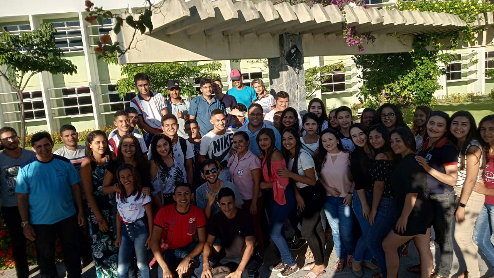

## ©recepcoes ð2019-05-24 Recepção da escola Abraão Baquit
###

Na tarde do dia 24 de Maio de 2019, 82 alunos da escola Abraão Baquit extensão de uma escola situada na sede de Quixadá, logo esta extensão, fica em um distrito chamado Cipó dos Anjos, escola de ensino médio é situada há aproximadamente 40 km da cidade de Quixadá.

Os alunos desta escola visitaram o Campus UFC Quixadá sendo recepcionados e orientados pelos alunos do projeto UFC nas escolas, onde os alunos do ensino médio tiveram a oportunidade de participar de uma palestra sobre nosso campus, conhecendo os cursos, as oportunidades de bolsas até mesmo as experiências de vida dos alunos da UFC Quixadá.

Durante a visita os alunos tiveram a oportunidade de conhecer a estrutura do campus. Muitos demonstraram interesse em cursos oferecidos pela universidade, tiraram dúvidas sobre as  formas de ingresso, notas de corte, dentre outras questões que foram esclarecidas.

Foi muito gratificante ter a oportunidade de ressaltar a importância da universidade não só na vida dos alunos mais também para toda sociedade, mostrar as oportunidades que a mesma provém e tudo isso para alunos do ensino médio. Nos despedimos com aquele convite de volte sempre para a Abraão Baquit extensão Cipó dos Anjos, somos gratos a visita de vocês no nosso Campus, voltem sempre!!!
