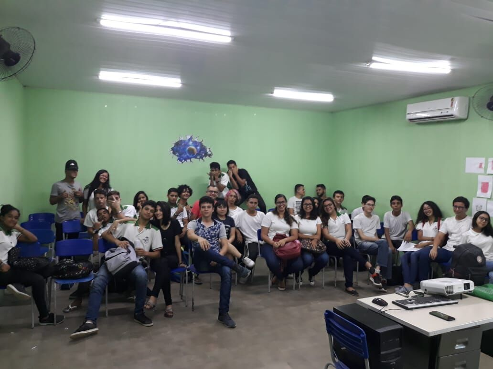

## ©visitas ð2019-05-24 Visita à escola Valder Ribeiro
###

E o UFC nas escolas no dia 24 de maio foi longe, visitou a escolas EEMTI José Valdo Ribeiro Ramos localizada em Fortaleza, onde uma ex-aluna do mesmo, que hoje faz parte da família UFC nas escolas, “Amanda Peixoto” foi apresentar um pouquinho do nosso campus, teve palestra falando sobre cursos e até mesmo de forma geral, mostrando um pouquinho das oportunidades que a UFC Quixadá disponibiliza, teve roda de conversa sobre o mercado de trabalho e oportunidades na área da TI.

O que acabou por ser percebido na visita é a falta de perspectivas de muitos alunos do ensino médio com relação à universidade, muitos acham que é algo impossível, muitos se encontram desestimulados, não conhecem as oportunidades, formas de ingresso, como funcionam os meios de ingresso a universidades dentre outras questões onde por fim enxergam a universidade como algo que jamais vai fazer parte da sua realidade, é justamente a fim de mudar esses paradigmas que trabalhamos.

O mais interessante dessa breve história é o fato da Amanda ter ingressado na UFC Quixadá por conta de um integrante do projeto UFC nas escolas, que no passado foi lá na sua escola, onde o mesmo também já foi aluno, apresentar o nosso campus, é muito gratificante perceber a importância de algumas pequenas ações, onde citando um pouco das nossas histórias de vida, compartilhamos a ideia de que todos são capazes de ingressar em uma universidade, independente de sua situação, de sua condição financeira, a UFC Campus de Quixadá estará sempre de portas abertas para receber todos vocês. 
