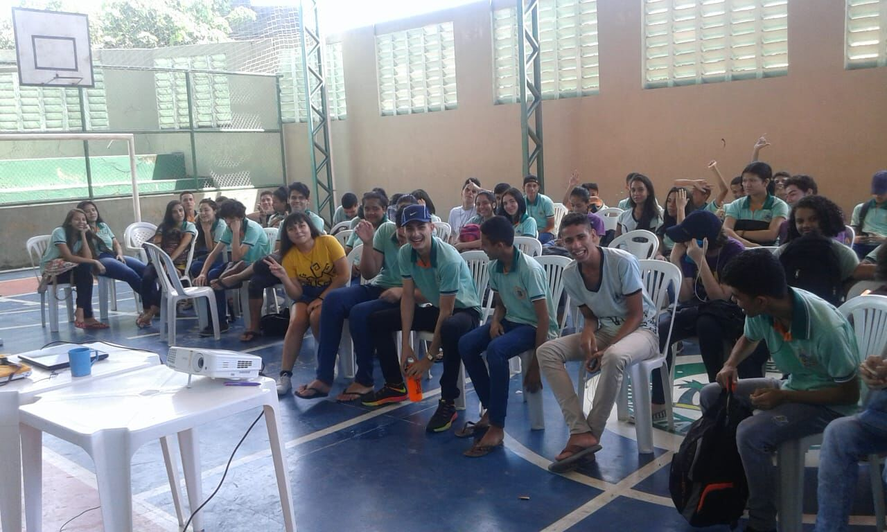

## ©visitas ð2019-05-24 Visita à escola Waldemar Falcão
###

E o projeto UFC nas escolas continua indo longe, mais uma escola visitada no dia 24 Maio, a da vez foi EEM Waldemar Falcão com 1700 alunos, situado em fortaleza em uma região carente com um elevado índice de criminalidade, o colégio enfrenta algumas dificuldades com relação há recursos, tais como materiais essências para se manter e até mesmo espaço,pois comporta muitos alunos para pouco espaço.

Mesmo com toda dificuldade recebeu o projeto de extensão UFC nas escolas de braços abertos, onde de cara durante palestra sobre o campus e rodas de conversas envolvendo TI ofertadas aos 200 alunos de terceiro ano, durante a visita foi percebido o engajamento dos alunos, muitos deles ficaram até surpresos com a existência de um campus de tecnologia no interior, muitos sequer ouviram falar no nosso campus UFC em Quixadá.

Outra questão interessante que foi levantada durante a visita foram algumas perguntas de pessoas com deficiência, que se surpreenderam ao saber que a universidade tem acessibilidade para os mesmos, que a universidade dispõe de uma estrutura adequada a recebê-los. Realmente um encontro muito proveitoso muitos alunos demonstraram interesse em nosso campus, em especial dois que quando questionados já citam até os cursos que almejam ingressar:

Bruno Leão:

    “Tirei as duvidas que tinha sobre o Sisu, Enem, notas e agora vou me preparar para o Enem, sobre o curso estou mais para ciências da computação ”.

Gabriel Vianna:

    “Eu gostei pois tinham coisas que eu não sabia sobre o Sisu, notas de corte, foi muito animado, bem receptivo, animado o bate papo, gostei bastante. Gosto muito de ciência da computação, já comecei até a estudar alguns conteúdos, esse vai ser meu curso  ”.

Gratos pela recepção EEM Waldemar Falcão... Agora tá faltando à visita ao campus UFC Quixadá, estamos esperando a visita...
