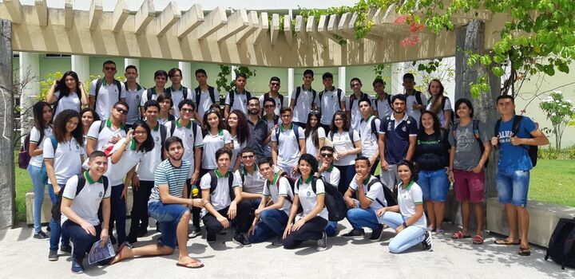

## ¢2019-09-18 Recepção da EEEP Celio Raimundo Célio Rodrigues & Nunca tinham visto uma galinha choca #palestra

- Escola: Raimundo Célio Rodrigues
- Lugar: Pacatuba
- Nível:  Profissionalizante
- Status: Veio ao Campus UFC-Quixadá

Hoje por volta das 10h do dia 18 de setembro de 2019, a Universidade Federal Campus Quixadá recebeu a escola EEEP Raimundo Célio Rodrigues para uma conversa.  Com ela 44 alunos do segundo ano e um professor  muito animados e curiosos por desvendar a UFC.

Os alunos da escola para tinham muitas duvidas sobre a vida universitária e desejavam conhecer mais sobre as bolsas e auxílios financeiros.

Os alunos escutaram a apresentação institucional com atenção e fizeram a visita guiada com bastante curiosidade. Todos demostraram interesse e fizeram muitas perguntas.

Também para nós do projeto houveram surpresas. Descobrimos que o professor Dalmo Maia, que trouxe a escola, foi aluno da primeira turma do curso de Sistema da Informação aqui da UFC lá em 2007. Nem seus próprios alunos sabiam!

Convidamos o professor para falar um pouco sobre o curso de Sistema da Informação naquela época e conforme ele ia relatando nós descobríamos coisas do nosso passado que nem nós sabíamos. Quanta coisa mudou, tanto em relação a estrutura física quanto organizacional.

Na época do Dalmo, a UFC ainda funcionava na estrutura do IFCE, não existia Restaurante universitário, nem biblioteca, nem nossos laboratórios!

Quem te viu, quem te vê UFC. Não bastasse a estrutura e a animação, você ainda é polo de atração de alunos de todo nosso sertão.

No mais, foi uma visita bastante agradável e uma troca de conversa tanto os alunos do projeto UFC nas Escolas quanto os alunos que vieram nos visitar. A UFC- Quixadá é imensamente grata pela visita da Escola Raimundo Célio Rodrigues e o nosso querido ex aluno Dalmo Maia.

Esperamos vocês como nossos futuros alunos-amigos!!!

