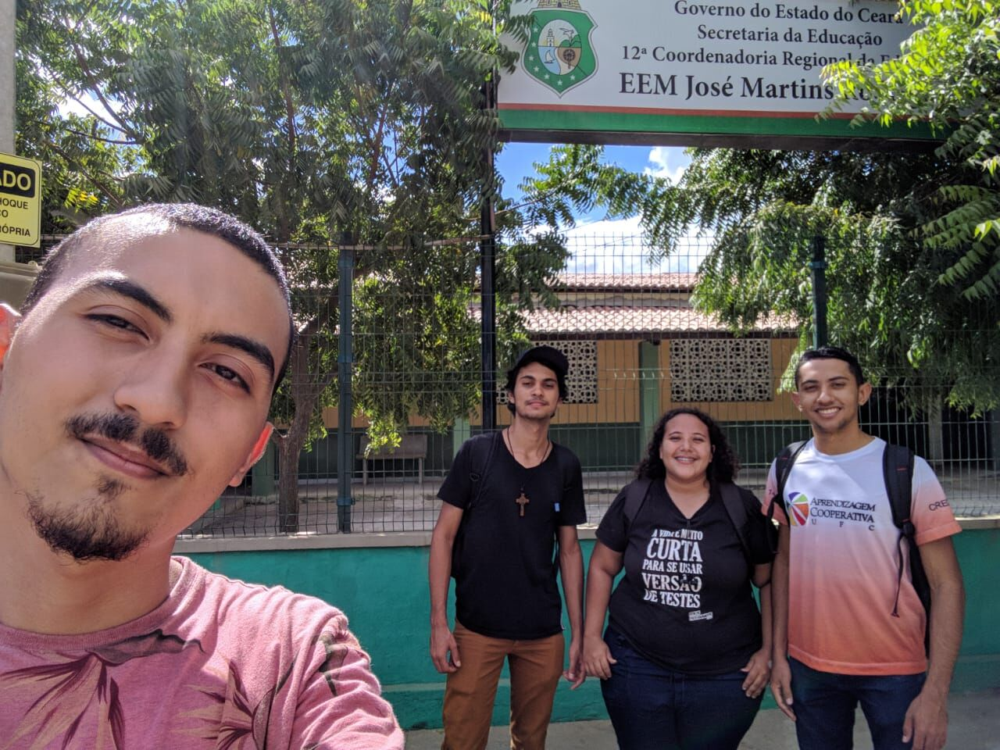

## ¢2019-05-30 Visita à escola José Martins £Visitas

Hoje foi um dia incrível para os alunos do projeto do UFC nas Escolas, o dia em que eles visitaram a escola de ensino médio José Martins Rodrigues para marcar um horário para fazer uma visita para mostrar o projeto, Michel integrante do projeto do curso de Sistema da Informação do primeiro semestre e bolsista de iniciação acadêmica, conta: *A Débora Ruth integrante do projeto perguntou se nós gostávamos de aventura, eu e o Pedro e Dheymison falamos que sim, então ela nos propôs a ir a pé em uma escola que fica a mais ou menos 2,5 km da UFC Campus-Quixadá, então a gente foi, chegando lá agendamos uma visita e voltamos a pé pra universidade sem contar que que na ida o sol estava super quente e na volta tomamos um banho de chuva, mas nada vai nos impedir de voltar e apresentar o projeto UFC nas Escolas para compartilhar e ajudar os alunos daquela escola, iremos voltar novamente, pode nos aguardar*
 
