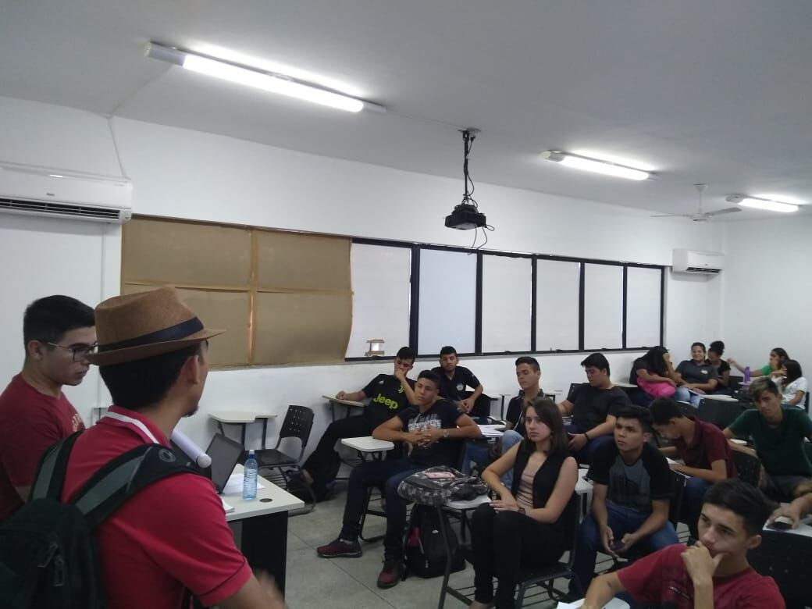

## ©visitas ð2019-06-18 Visita ao IFCE
###

A visita ao IFCE foi bem desafiadora para os membros do projeto UFC nas Escolas pois primeiro tivermos que agendar uma visita para o coordenador de curso do instituto, porém o mesmo não se encontrava, mas a Danielle Queiroz vice Coordenadora  falou com os membros do projeto e autorizou eles a apresentar um pouco do que se trata o projeto UFC nas Escolas, a parte mais difícil foi quando ela falou que eles só teriam 10 minutos para apresentar e só uma turma para apresentar pois a outra turma estavam fazendo provas, mas os meninos do projeto foram até fim e apresentaram os cursos e premiações que recebemos até agora, e estrutura do nosso campus, os alunos fizeram bastante e perguntas e se interessaram pelo curso de Engenharia de Software. logo após a conversa sobre o projeto UFC nas Escolas, Alan do curso técnico de edificações relatou:
> Estou muito feliz em saber que existe vários benefícios na UFC Campus-Quixadá, até então pensava que só a UFC de Fortaleza oferecesse estes benefícios como bolsas e auxílios, estou muito feliz e pretendo fazer o Enem e entrar para o curso de Engenharia de Software.
Ficamos muito felizes em saber que conseguimos incentivar o Alan a cursar Engenharia de Software, esperamos você em 2020.1, e agradecemos ao IFCE por nos receber e apresentar projeto UFC nas Escolas 
