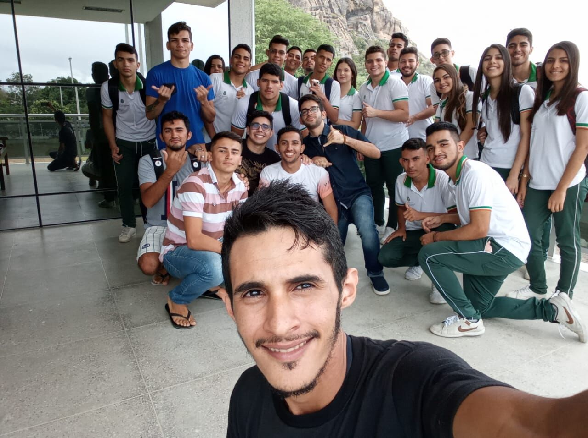

## ©recepcoes ð2019-08-06 Recepção da escola Salomão Alves
###

A Universidade Federal do Ceará Campus Quixadá começa o semestre de 2019.2 com a ilustre visita da Escola de Ensino de Profissionalizante Dr. Salomão Alves de Moura colégio situado na cidade de Aracoiaba, a escola veio até o Campus UFC-Quixadá com os cursos Redes de Computadores, Edificações e Informática para conheceram os cursos ofertados e nossa estrutura, as bolsas e auxílios que a Universidade Federal do Ceará oferece, os alunos ficaram bastante empolgados com a visita ao campus e além de tirar dúvidas sobre a vida acadêmica e sobre como é morar em outra cidade. Foi um imenso prazer receber todos vocês nessa visita ao nosso Campus e a UFC-Quixadá estará sempre de portas abertas para recebê-los, e nos encontramos em 2020 nossos futuro alunos do Campus
UFC-Quixadá ❤️ ❤️
